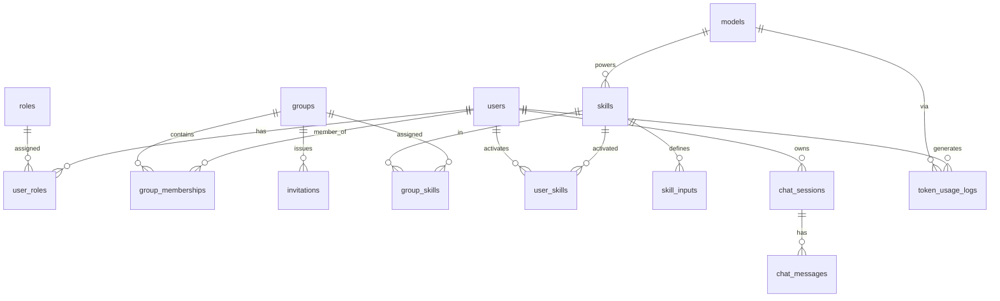

# Архітектура рішення AI Knowledge Hub

**Стек:** Python 3.11+, Flask (REST API), SQLAlchemy + SQLite
**Документ:** архітектура рішення + структура БД (основа для задачі Claude Code)

---

## 1. Принципи та ключові рішення

1. **REST API-first.** Бекенд віддає чистий JSON API. Це дозволяє перевикористати той самий бекенд для веб-панелі (MVP) і для iOS-застосунку (наступний етап) без дублювання логіки.
2. **Гібридна рольова модель (RBAC).** Розрізняємо два типи ролей:
   - *Глобальні* (системні): `Admin`, `Skill Manager` — зберігаються у зв'язці `user_roles`.
   - *Локальні* (в межах групи): `Group Manager`, `Group Member` — зберігаються як атрибут членства у `group_memberships.role`. Один користувач може мати різні ролі в різних групах.
3. **Подвійне призначення скілів.** Скіл стає доступним користувачу двома шляхами: (а) призначення на рівні **групи** (Group Manager → усі члени групи) та (б) **самостійна активація** користувачем для себе з каталогу `published`-скілів. Ефективний доступ матеріалізується в таблиці `user_skills` (одна стрічка на користувача), що дає простий і точний підрахунок активацій.
4. **Шарова архітектура** (API → Service → Repository/ORM) для чистого розділення відповідальностей і простоти тестування.
5. **Інтеграція з Azure AI Foundry** ізольована в окремому модулі-адаптері. Уся робота з моделями (LLM/CV) проходить через нього → облік токенів централізований. Реєструвати/підключати моделі може **лише Admin**.
6. **SQLite з можливістю міграції на PostgreSQL.** Працюємо через SQLAlchemy + Alembic, не використовуємо SQLite-специфічних конструкцій без потреби, вмикаємо WAL та `foreign_keys=ON`.
7. **Forward-compatible схема.** Поля під Entra ID та детальні ліміти токенів закладені одразу (NULL у MVP), щоб уникнути важких міграцій на Етапі 2.

---

## 2. Технологічний стек

| Шар | Технологія |
| --- | --- |
| Web framework | Flask + Blueprints |
| ORM / міграції | Flask-SQLAlchemy + Flask-Migrate (Alembic) |
| Авторизація | Flask-JWT-Extended (JWT access + refresh) |
| Хешування паролів | Werkzeug / Argon2 (passlib) |
| Валідація / серіалізація | Marshmallow (або Pydantic) |
| Планувальник (Етап 2) | APScheduler (скидання лімітів) |
| AI-інтеграція | openai SDK у режимі Azure / azure-ai-* |
| База даних | SQLite (WAL), сумісно з PostgreSQL |

---

## 3. Шари та компоненти

```
┌──────────────────────────────────────────────────────────────┐
│  КЛІЄНТИ:  Веб-панель (MVP)        iOS-застосунок (Етап 2)     │
└───────────────────────────┬──────────────────────────────────┘
                            │ HTTPS / JSON (JWT)
┌───────────────────────────▼──────────────────────────────────┐
│  API LAYER (Flask Blueprints)                                 │
│  auth · users · groups · skills · models · chat · usage       │
│  ── декоратори RBAC, валідація схем, обробка помилок           │
├──────────────────────────────────────────────────────────────┤
│  SERVICE LAYER (бізнес-логіка)                                │
│  AuthService · UserService · GroupService · SkillService ·    │
│  ChatService · TokenService · AuditService                    │
├──────────────────────────────────────────────────────────────┤
│  DATA ACCESS LAYER (SQLAlchemy models / repositories)         │
├──────────────────────────────────────────────────────────────┤
│  INTEGRATION LAYER                                            │
│  AzureFoundryClient (LLM/CV) · (Етап 2) EntraIDProvider       │
└───────────────────────────┬──────────────────────────────────┘
                            │
                  ┌─────────▼─────────┐         ┌──────────────────┐
                  │   SQLite (WAL)    │         │ Azure AI Foundry │
                  └───────────────────┘         │  (LLM + CV)      │
                                                └──────────────────┘
```

**Призначення сервісів:**
- **AuthService** — логін/пароль, видача JWT, refresh, (Етап 2) OIDC через Entra ID.
- **UserService** — CRUD користувачів, скидання паролів, призначення глобальних ролей (тільки Admin).
- **GroupService** — створення груп, членство, інвайти, призначення скілів групі; enforced-правило «мінімум 1 менеджер»; синхронізація `user_skills` при змінах членства.
- **SkillService** — життєвий цикл скілів, параметри вхідних даних, самостійна активація користувачем, перерахунок лічильника активацій; реєстр моделей (підключення — лише Admin).
- **PackageService** — скіли-пакети: розбір архіву та `skill.md`, безпечне розпакування, збереження та **ізольоване виконання Python-коду** (підпроцес, таймаут, ліміти ресурсів), захоплення створених файлів.
- **FileService** — постійне сховище файлів користувача: підкаталог з GUID-назвою (`storage_uid`), збереження файлів від скілів та завантажених користувачем, перелік, звантаження, видалення.
- **QuotaService** — тижневі квоти токенів: системна (`global`) та персональна (`user`, пріоритетна), лічильник використання (`token_counters`), енфорсмент (429) і скидання щопонеділка о 00:05 UTC (планувальник + «ліниве» за тижневим вікном).
- **ChatService** — оркестрація чату з **обраною користувачем моделлю**: створення сесій, багатоходовий діалог з історією, **опційне застосування скілів** до повідомлень, виклик відповідного провайдера через фабрику клієнтів та облік токенів (вхідні/вихідні/загальні). Доступні лише `is_active`-моделі.
- **TokenService** — логування використання токенів, агрегація, (Етап 2) перевірка лімітів.
- **AuditService** — журнал значимих дій (адмін-операції, зміни доступів).

---

## 4. Модель безпеки та матриця прав

| Дія | Admin | Skill Manager | Group Manager | Group Member |
| --- | :---: | :---: | :---: | :---: |
| Системні налаштування | ✓ | ✗ | ✗ | ✗ |
| CRUD користувачів (глобально), скидання паролів | ✓ | ✗ | ✗ | ✗ |
| Призначення глобальних ролей | ✓ | ✗ | ✗ | ✗ |
| Реєстрація/підключення моделей | ✓ | ✗ | ✗ | ✗ |
| CRUD скілів (тест/деплой/публікація/делістинг) | ✓ | ✓ | ✗ | ✗ |
| Визначення вхідних параметрів скіла | ✓ | ✓ | ✗ | ✗ |
| Створення груп | ✓ | ✗ | ✗ | ✗ |
| Запрошення/видалення мемберів | ✓ (будь-яка) | ✗ | ✓ (своя група) | ✗ |
| Призначення скілів **групі** | ✓ | ✗ | ✓ (своя група) | ✗ |
| **Самостійна** активація `published`-скіла (для себе) | ✓ | ✓ | ✓ | ✓ |
| Використання скілів / чат | ✓ | ✓ | ✓ | ✓ |
| Перегляд токенів (глобально) | ✓ | ✗ | ✗ | ✗ |
| Перегляд токенів групи | ✓ | ✗ | ✓ (своя група) | ✗ |
| Перегляд власних токенів | ✓ | ✓ | ✓ | ✓ |

> Перевірка прав — через декоратори: `@require_global_role('admin')`, `@require_group_role('manager', group_id)`. `is_system_admin` дає швидкий шлях для супер-адміна.

---

## 5. Структура проєкту (для Claude Code)

```
smart-digital-skills/
├── app/
│   ├── __init__.py            # фабрика застосунку (create_app)
│   ├── config.py              # конфіги Dev/Prod, шлях до SQLite, секрети
│   ├── extensions.py          # db, migrate, jwt, ma
│   ├── models/                # SQLAlchemy моделі (по файлу на домен)
│   │   ├── user.py  role.py  group.py  skill.py  model.py
│   │   ├── chat.py  token_usage.py  audit.py
│   ├── api/                   # Blueprints (REST endpoints)
│   │   ├── auth.py  users.py  groups.py  skills.py
│   │   ├── models.py  chat.py  usage.py
│   ├── services/              # бізнес-логіка
│   ├── schemas/               # Marshmallow-схеми
│   ├── core/
│   │   ├── security.py        # хеш паролів, JWT
│   │   ├── permissions.py     # декоратори RBAC
│   │   └── errors.py
│   └── integrations/
│       └── azure_foundry.py
├── migrations/                # Alembic
├── scripts/
│   ├── init_db.py             # створення схеми
│   └── seed.py                # початкові дані
├── tests/
├── instance/profihub.db
├── requirements.txt
├── .env.example
├── wsgi.py
└── README.md
```

---

## 6. Структура бази даних

### ER-зв'язки (стисло)



### Опис таблиць

| Таблиця | Призначення |
| --- | --- |
| `roles` | Довідник глобальних ролей (`admin`, `skill_manager`) |
| `users` | Користувачі (логін/пароль + поля під Entra ID) |
| `user_roles` | M:N глобальних ролей користувача |
| `groups` | Групи (відділи/департаменти) |
| `group_memberships` | Членство + роль у групі (`manager`/`member`) + статус |
| `invitations` | Запрошення нових користувачів за email |
| `models` | Реєстр моделей Azure AI Foundry (LLM/CV) |
| `skills` | Каталог скілів, життєвий цикл, версія, лічильник активацій |
| `skill_inputs` | Параметри вхідних даних скіла (обов'язкові/опціональні) |
| `catalog_sections` | Розділи каталогу («Business Box») — друга вісь навігації хабу |
| `catalog_resources` | Наповнення каталогу поза скілами: промпти, інструкції, кейси, агенти, посилання |
| `catalog_favorites` | «Обране» користувача (спільне для скілів і ресурсів каталогу) |
| `review_logs` | Журнал життєвого циклу матеріалу (хто, коли, з якого статусу в який) |
| `search_query_logs` | Пошукові запити користувачів для аналітики хабу |
| `group_skills` | Призначення скілів групам (груповий доступ) |
| `user_skills` | Матеріалізований ефективний доступ користувача до скіла (self/group) |
| `chat_sessions` / `chat_messages` | Діалоги з моделями |
| `token_usage_logs` | Облік токенів (MVP) |
| `token_limits` | Детальні ліміти (Етап 2, схема наперед) |
| `audit_logs` | Журнал дій |
| `refresh_tokens` | Refresh-токени JWT |

---

## 7. SQL DDL (SQLite)

```sql
PRAGMA foreign_keys = ON;

-- Глобальні ролі
CREATE TABLE roles (
    id          INTEGER PRIMARY KEY AUTOINCREMENT,
    code        TEXT NOT NULL UNIQUE,          -- 'admin', 'skill_manager'
    name        TEXT NOT NULL,
    description TEXT
);

-- Користувачі
CREATE TABLE users (
    id              INTEGER PRIMARY KEY AUTOINCREMENT,
    username        TEXT NOT NULL UNIQUE,
    email           TEXT UNIQUE,
    password_hash   TEXT,                       -- NULL для Entra ID
    full_name       TEXT,
    auth_provider   TEXT NOT NULL DEFAULT 'local'
                    CHECK (auth_provider IN ('local','entra_id')),
    external_id     TEXT,                       -- Entra ID object id (Етап 2)
    is_active       INTEGER NOT NULL DEFAULT 1,
    is_system_admin INTEGER NOT NULL DEFAULT 0,
    storage_uid     TEXT UNIQUE,                 -- GUID-назва теки файлів користувача
    last_login_at   TEXT,
    created_at      TEXT NOT NULL DEFAULT (datetime('now')),
    updated_at      TEXT NOT NULL DEFAULT (datetime('now'))
);

-- Файли користувача (зберігаються назавжди у <USER_FILES_DIR>/<storage_uid>/)
CREATE TABLE user_files (
    id           INTEGER PRIMARY KEY AUTOINCREMENT,
    user_id      INTEGER NOT NULL REFERENCES users(id) ON DELETE CASCADE,
    filename     TEXT NOT NULL,                  -- відображувана назва
    stored_name  TEXT NOT NULL,                  -- фізична назва у теці користувача
    content_type TEXT,
    size         INTEGER NOT NULL DEFAULT 0,
    source       TEXT NOT NULL DEFAULT 'upload'  -- 'upload' | 'skill_run'
                 CHECK (source IN ('upload','skill_run')),
    skill_id     INTEGER REFERENCES skills(id),  -- якщо створено скілом
    created_at   TEXT NOT NULL DEFAULT (datetime('now'))
);

-- Глобальні ролі користувача (M:N)
CREATE TABLE user_roles (
    user_id INTEGER NOT NULL REFERENCES users(id) ON DELETE CASCADE,
    role_id INTEGER NOT NULL REFERENCES roles(id) ON DELETE CASCADE,
    PRIMARY KEY (user_id, role_id)
);

-- Групи
CREATE TABLE groups (
    id          INTEGER PRIMARY KEY AUTOINCREMENT,
    name        TEXT NOT NULL UNIQUE,
    description TEXT,
    is_active   INTEGER NOT NULL DEFAULT 1,
    created_by  INTEGER REFERENCES users(id),
    created_at  TEXT NOT NULL DEFAULT (datetime('now')),
    updated_at  TEXT NOT NULL DEFAULT (datetime('now'))
);

-- Членство в групі + локальна роль
CREATE TABLE group_memberships (
    id         INTEGER PRIMARY KEY AUTOINCREMENT,
    group_id   INTEGER NOT NULL REFERENCES groups(id) ON DELETE CASCADE,
    user_id    INTEGER NOT NULL REFERENCES users(id) ON DELETE CASCADE,
    role       TEXT NOT NULL DEFAULT 'member' CHECK (role IN ('manager','member')),
    status     TEXT NOT NULL DEFAULT 'active'
               CHECK (status IN ('invited','active','removed')),
    invited_by INTEGER REFERENCES users(id),
    joined_at  TEXT NOT NULL DEFAULT (datetime('now')),
    UNIQUE (group_id, user_id)
);

-- Запрошення за email
CREATE TABLE invitations (
    id          INTEGER PRIMARY KEY AUTOINCREMENT,
    group_id    INTEGER NOT NULL REFERENCES groups(id) ON DELETE CASCADE,
    email       TEXT NOT NULL,
    role        TEXT NOT NULL DEFAULT 'member' CHECK (role IN ('manager','member')),
    token       TEXT NOT NULL UNIQUE,
    invited_by  INTEGER NOT NULL REFERENCES users(id),
    status      TEXT NOT NULL DEFAULT 'pending'
                CHECK (status IN ('pending','accepted','expired','revoked')),
    expires_at  TEXT,
    created_at  TEXT NOT NULL DEFAULT (datetime('now')),
    accepted_at TEXT
);

-- Реєстр моделей Azure AI Foundry (підключає лише Admin)
CREATE TABLE models (
    id              INTEGER PRIMARY KEY AUTOINCREMENT,
    name            TEXT NOT NULL,
    model_type      TEXT NOT NULL CHECK (model_type IN ('llm','cv')),
    provider        TEXT NOT NULL DEFAULT 'azure_ai_foundry',
    deployment_name TEXT NOT NULL,               -- деплоймент у Foundry
    api_version     TEXT,
    context_window  INTEGER,
    config          TEXT,                         -- JSON
    is_active       INTEGER NOT NULL DEFAULT 1,
    is_system       INTEGER NOT NULL DEFAULT 0,    -- системна модель (службові задачі)
    created_at      TEXT NOT NULL DEFAULT (datetime('now')),
    updated_at      TEXT NOT NULL DEFAULT (datetime('now'))
);

-- Каталог навичок (LLM-навички та навички-пакети з кодом)
CREATE TABLE skills (
    id                INTEGER PRIMARY KEY AUTOINCREMENT,
    name              TEXT NOT NULL,
    description       TEXT NOT NULL,                -- обов'язковий опис
    author            TEXT,                         -- автор (зі skill.md, редагується)
    category          TEXT,                         -- категорія (зі skill.md, редагується)
    skill_kind        TEXT NOT NULL DEFAULT 'prompt'-- 'prompt' (LLM) | 'package' (код)
                      CHECK (skill_kind IN ('prompt','package')),
    model_id          INTEGER REFERENCES models(id),-- nullable: пакетам не потрібен
    prompt_template   TEXT,                         -- для LLM; для пакета — інструкції
    parameters        TEXT,                         -- JSON: temperature, top_p
    runtime           TEXT,                         -- скіл-пакет: напр. 'python'
    entrypoint        TEXT,                         -- скіл-пакет: файл запуску
    package_filename  TEXT,                         -- оригінальна назва архіву
    package_path      TEXT,                         -- шлях до збереженого архіву
    status            TEXT NOT NULL DEFAULT 'draft'  -- 'draft' = «Не опублікована»
                      CHECK (status IN ('draft','published')),
    version           TEXT NOT NULL DEFAULT '1.0.0',-- семантична версія
    activations_count INTEGER NOT NULL DEFAULT 0,   -- к-сть унікальних активацій (denormalized)
    created_by        INTEGER REFERENCES users(id),
    created_at        TEXT NOT NULL DEFAULT (datetime('now')),
    updated_at        TEXT NOT NULL DEFAULT (datetime('now')),
    published_at      TEXT
);

-- Розділи каталогу («Business Box») — друга вісь навігації.
-- url заповнено, якщо розділ поки живе у зовнішньому порталі (гібридний режим).
CREATE TABLE catalog_sections (
    id          INTEGER PRIMARY KEY AUTOINCREMENT,
    name        TEXT NOT NULL UNIQUE,
    description TEXT,
    icon_emoji  TEXT,
    accent      TEXT,
    url         TEXT,                          -- зовнішній розділ; NULL = власні матеріали
    position    INTEGER NOT NULL DEFAULT 0,
    is_active   INTEGER NOT NULL DEFAULT 1,
    created_at  TEXT NOT NULL DEFAULT (datetime('now'))
);

-- Наповнення каталогу поза скілами: промпти, інструкції, кейси, агенти, посилання
CREATE TABLE catalog_resources (
    id             INTEGER PRIMARY KEY AUTOINCREMENT,
    resource_type  TEXT NOT NULL DEFAULT 'prompt'
                   CHECK (resource_type IN ('prompt','instruction','case',
                                            'agent','mcp','link')),
    name           TEXT NOT NULL,
    description    TEXT NOT NULL DEFAULT '',
    category       TEXT,
    section_id     INTEGER REFERENCES catalog_sections(id),
    author         TEXT,
    owner          TEXT,                         -- відповідальний за матеріал
    tags           TEXT,                         -- через кому
    body           TEXT,                         -- текст промпту / інструкції (Markdown)
    url            TEXT,                         -- посилання (agent | link)
    link_scope     TEXT CHECK (link_scope IN ('external','internal')),
    tools          TEXT,                         -- інструменти та платформи
    reuse_level    TEXT CHECK (reuse_level IN ('ready','adaptable','reference')),
    reviewed_at    TEXT,                         -- дата останнього перегляду
    next_review_at TEXT,                         -- дата наступного перегляду
    icon_emoji     TEXT,                         -- емодзі-іконка плитки
    accent         TEXT,                         -- колір плитки; NULL = типовий для виду
    is_featured    INTEGER NOT NULL DEFAULT 0,   -- «рекомендований» — першим у каталозі
    status         TEXT NOT NULL DEFAULT 'draft'
                   CHECK (status IN ('draft','published','needs_update','archived')),
    version        TEXT NOT NULL DEFAULT '1.0.0',
    opens_count    INTEGER NOT NULL DEFAULT 0,   -- відкриття / копіювання
    created_by     INTEGER REFERENCES users(id),
    created_at     TEXT NOT NULL DEFAULT (datetime('now')),
    updated_at     TEXT NOT NULL DEFAULT (datetime('now')),
    published_at   TEXT
);

-- Журнал життєвого циклу матеріалу: хто, коли і з якого статусу в який перевів
CREATE TABLE review_logs (
    id            INTEGER PRIMARY KEY AUTOINCREMENT,
    item_type     TEXT NOT NULL DEFAULT 'resource'
                  CHECK (item_type IN ('resource','skill')),
    item_id       INTEGER NOT NULL,
    item_name     TEXT,                          -- знімок назви
    actor_user_id INTEGER REFERENCES users(id),
    actor_name    TEXT,
    from_status   TEXT,
    to_status     TEXT NOT NULL,
    note          TEXT,
    created_at    TEXT NOT NULL DEFAULT (datetime('now'))
);

-- Пошукові запити користувачів: що шукають і що не знаходять
CREATE TABLE search_query_logs (
    id               INTEGER PRIMARY KEY AUTOINCREMENT,
    query            TEXT NOT NULL,
    query_norm       TEXT NOT NULL,              -- нижній регістр — для групування
    results_count    INTEGER NOT NULL DEFAULT 0,
    section_id       INTEGER REFERENCES catalog_sections(id),
    kind             TEXT,                       -- активний фільтр за видом
    user_id          INTEGER REFERENCES users(id),
    opened_item_type TEXT,                       -- заповнено, якщо запит завершився відкриттям
    opened_item_id   INTEGER,
    created_at       TEXT NOT NULL DEFAULT (datetime('now'))
);

-- «Обране» користувача — спільне для скілів і ресурсів каталогу
CREATE TABLE catalog_favorites (
    id         INTEGER PRIMARY KEY AUTOINCREMENT,
    user_id    INTEGER NOT NULL REFERENCES users(id) ON DELETE CASCADE,
    item_type  TEXT NOT NULL DEFAULT 'skill' CHECK (item_type IN ('skill','resource')),
    item_id    INTEGER NOT NULL,
    created_at TEXT NOT NULL DEFAULT (datetime('now')),
    UNIQUE (user_id, item_type, item_id)
);

-- Параметри вхідних даних скіла (обов'язкові / опціональні)
CREATE TABLE skill_inputs (
    id            INTEGER PRIMARY KEY AUTOINCREMENT,
    skill_id      INTEGER NOT NULL REFERENCES skills(id) ON DELETE CASCADE,
    name          TEXT NOT NULL,                  -- технічний ключ параметра
    label         TEXT,                           -- людська назва
    data_type     TEXT NOT NULL DEFAULT 'string'
                  CHECK (data_type IN ('string','number','boolean','image','file','json')),
    is_required   INTEGER NOT NULL DEFAULT 1,     -- 1 = обов'язковий, 0 = опціональний
    default_value TEXT,
    description   TEXT,
    position      INTEGER NOT NULL DEFAULT 0,     -- порядок у формі
    UNIQUE (skill_id, name)
);

-- Призначення скілів групам (груповий доступ)
CREATE TABLE group_skills (
    id          INTEGER PRIMARY KEY AUTOINCREMENT,
    group_id    INTEGER NOT NULL REFERENCES groups(id) ON DELETE CASCADE,
    skill_id    INTEGER NOT NULL REFERENCES skills(id) ON DELETE CASCADE,
    assigned_by INTEGER REFERENCES users(id),
    is_active   INTEGER NOT NULL DEFAULT 1,
    assigned_at TEXT NOT NULL DEFAULT (datetime('now')),
    UNIQUE (group_id, skill_id)
);

-- Матеріалізований ефективний доступ користувача до скіла.
-- Одна стрічка на (user, skill) => природний підрахунок унікальних активацій.
CREATE TABLE user_skills (
    id          INTEGER PRIMARY KEY AUTOINCREMENT,
    user_id     INTEGER NOT NULL REFERENCES users(id) ON DELETE CASCADE,
    skill_id    INTEGER NOT NULL REFERENCES skills(id) ON DELETE CASCADE,
    source      TEXT NOT NULL DEFAULT 'self' CHECK (source IN ('self','group')),
    group_id    INTEGER REFERENCES groups(id),  -- джерело-група, якщо source='group'
    assigned_by INTEGER REFERENCES users(id),
    is_active   INTEGER NOT NULL DEFAULT 1,
    assigned_at TEXT NOT NULL DEFAULT (datetime('now')),
    UNIQUE (user_id, skill_id)                   -- "крім тих, у кого вже був скіл"
);

-- Сесії чату (користувач обирає модель для діалогу)
CREATE TABLE chat_sessions (
    id         INTEGER PRIMARY KEY AUTOINCREMENT,
    user_id    INTEGER NOT NULL REFERENCES users(id) ON DELETE CASCADE,
    group_id   INTEGER REFERENCES groups(id),
    model_id   INTEGER REFERENCES models(id),      -- обрана модель чату
    skill_id   INTEGER REFERENCES skills(id),      -- для сесій запуску скіла
    title      TEXT,
    created_at TEXT NOT NULL DEFAULT (datetime('now')),
    updated_at TEXT NOT NULL DEFAULT (datetime('now'))
);

-- Повідомлення чату
CREATE TABLE chat_messages (
    id                INTEGER PRIMARY KEY AUTOINCREMENT,
    session_id        INTEGER NOT NULL REFERENCES chat_sessions(id) ON DELETE CASCADE,
    role              TEXT NOT NULL CHECK (role IN ('system','user','assistant')),
    content           TEXT,
    skill_id          INTEGER REFERENCES skills(id), -- застосований до повідомлення скіл (опц.)
    metadata          TEXT,                       -- JSON: вкладення, CV-результати
    prompt_tokens     INTEGER DEFAULT 0,          -- вхідні токени (на user-повідомленні)
    completion_tokens INTEGER DEFAULT 0,          -- вихідні токени (на assistant-повідомленні)
    total_tokens      INTEGER DEFAULT 0,
    created_at        TEXT NOT NULL DEFAULT (datetime('now'))
);

-- Облік токенів (MVP)
CREATE TABLE token_usage_logs (
    id                INTEGER PRIMARY KEY AUTOINCREMENT,
    user_id           INTEGER NOT NULL REFERENCES users(id),
    group_id          INTEGER REFERENCES groups(id),
    skill_id          INTEGER REFERENCES skills(id),
    model_id          INTEGER REFERENCES models(id),
    session_id        INTEGER REFERENCES chat_sessions(id),
    prompt_tokens     INTEGER NOT NULL DEFAULT 0,
    completion_tokens INTEGER NOT NULL DEFAULT 0,
    total_tokens      INTEGER NOT NULL DEFAULT 0,
    feature           TEXT NOT NULL DEFAULT 'chat',  -- 'chat' | 'chat_naming' | ...
    is_system         INTEGER NOT NULL DEFAULT 0,    -- системне використання (поза квотами)
    created_at        TEXT NOT NULL DEFAULT (datetime('now'))
);

-- Квоти токенів: 'global' (системна) та 'user' (персональна, пріоритетна)
CREATE TABLE token_limits (
    id           INTEGER PRIMARY KEY AUTOINCREMENT,
    scope_type   TEXT NOT NULL CHECK (scope_type IN ('global','group','user')),
    scope_id     INTEGER,                         -- NULL для global, інакше user_id
    period       TEXT NOT NULL DEFAULT 'weekly',  -- у MVP — 'weekly'
    limit_tokens INTEGER NOT NULL,
    is_active    INTEGER NOT NULL DEFAULT 1,
    created_at   TEXT NOT NULL DEFAULT (datetime('now')),
    updated_at   TEXT NOT NULL DEFAULT (datetime('now'))
);

-- Тижневий лічильник використаних токенів користувача
CREATE TABLE token_counters (
    user_id      INTEGER PRIMARY KEY REFERENCES users(id) ON DELETE CASCADE,
    used_tokens  INTEGER NOT NULL DEFAULT 0,
    period_start TEXT,                            -- початок поточного тижня (UTC)
    updated_at   TEXT NOT NULL DEFAULT (datetime('now'))
);

-- Аудит
CREATE TABLE audit_logs (
    id            INTEGER PRIMARY KEY AUTOINCREMENT,
    actor_user_id INTEGER REFERENCES users(id),
    action        TEXT NOT NULL,
    entity_type   TEXT,
    entity_id     INTEGER,
    details       TEXT,                            -- JSON
    ip_address    TEXT,
    created_at    TEXT NOT NULL DEFAULT (datetime('now'))
);

-- Refresh-токени JWT
CREATE TABLE refresh_tokens (
    id         INTEGER PRIMARY KEY AUTOINCREMENT,
    user_id    INTEGER NOT NULL REFERENCES users(id) ON DELETE CASCADE,
    token_hash TEXT NOT NULL,
    expires_at TEXT NOT NULL,
    revoked    INTEGER NOT NULL DEFAULT 0,
    created_at TEXT NOT NULL DEFAULT (datetime('now'))
);

-- Індекси
CREATE INDEX idx_gm_user       ON group_memberships(user_id);
CREATE INDEX idx_gm_group      ON group_memberships(group_id);
CREATE INDEX idx_user_skills_s ON user_skills(skill_id);
CREATE INDEX idx_user_skills_u ON user_skills(user_id);
CREATE INDEX idx_skill_inputs  ON skill_inputs(skill_id);
CREATE INDEX idx_usage_user    ON token_usage_logs(user_id);
CREATE INDEX idx_usage_group   ON token_usage_logs(group_id);
CREATE INDEX idx_usage_date    ON token_usage_logs(created_at);
CREATE INDEX idx_msg_session   ON chat_messages(session_id);
CREATE INDEX idx_skills_status ON skills(status);
```

---

## 8. Початкові дані (seed)

- **Ролі:** `admin`, `skill_manager`.
- **Супер-адмін:** `admin` (зі згенерованим паролем, `is_system_admin = 1`).
- **Демо-моделі:** `gpt-4o` (`llm`), `image-analyzer` (`cv`).
- **Демо-скіл:** `Summarizer` (`status = 'published'`, `version = '1.0.0'`) на базі LLM-моделі, з параметрами вхідних даних:
  - `text` (string, **обов'язковий**) — текст для опрацювання;
  - `language` (string, опціональний) — мова відповіді.
- **Демо-група:** `Default Department` з адміном як менеджером (демонстрація правила безперервності управління).
- **Демо-користувачі:** 1–2 мембери для перевірки призначення скілів (групового та самостійного).

---

## 9. Ключові бізнес-правила (enforced у Service Layer)

1. **Мінімум один менеджер у групі.** При видаленні останнього `group_manager` система автоматично призначає менеджером системного `Admin` (правило з PRD).

2. **Підключення моделей — лише Admin.** Skill Manager будує скіли поверх наявних моделей, але не реєструє самі моделі. Admin може **додавати, видаляти та активувати/деактивувати** моделі. Видалення заблоковане, якщо модель використовується хоча б одним скілом.

2a. **Лише активні моделі (`is_active=1`) доступні користувачам** для вибору в чаті. Деактивована модель зникає зі списку вибору, а спроба чату з нею відхиляється.

2b. **Мультипровайдерність.** Кожна модель має `provider` (`azure_ai_foundry` / `openai` / `gemini`). Фабрика клієнтів обирає відповідний адаптер; у MVP усі працюють у режимі моку (`LLM_MOCK=1`).

3. **Кожен скіл обов'язково має:** `description` (опис), `version` (семантична версія), перелік вхідних параметрів у `skill_inputs` з прапорцем `is_required` (обов'язкові/опціональні), та `activations_count` (к-сть активацій).

4. **Подвійне призначення скіла → таблиця `user_skills`** (одна стрічка на користувача, `UNIQUE(user_id, skill_id)`):
   - *Самостійна активація:* `INSERT user_skills(user, skill, source='self')`. Якщо стрічка вже є — активацій не додається.
   - *Призначення групі:* запис у `group_skills` + для кожного активного мембера `INSERT OR IGNORE user_skills(user, skill, source='group', group_id)`. Кількість реально вставлених стрічок і є приростом активацій.
   - *Новий мембер групи* успадковує всі скіли групи (`INSERT OR IGNORE`).
   - *Видалення скіла з групи / мембера з групи:* деактивуються стрічки `source='group'` цієї групи, **якщо** користувач не має іншого джерела доступу (self або інша група).

5. **Лічильник активацій** = к-сть унікальних користувачів з активним доступом:
   `UPDATE skills SET activations_count = (SELECT COUNT(*) FROM user_skills WHERE skill_id=? AND is_active=1) WHERE id=?`
   Це автоматично реалізує правило «плюс усі члени групи, крім тих, у кого скіл уже був» (за рахунок `UNIQUE(user_id, skill_id)`).

6. **Видимість скіла для мембера** = наявність активної стрічки в `user_skills`. У каталозі для самостійної активації показуються лише `published`-скіли.

7. **Життєвий цикл навички:** два стани — `draft` («Не опублікована», статус щойно завантаженої) та `published` («Опублікована»). Admin/Skill Manager публікує та скасовує публікацію. Призначати/активувати можна лише `published`. Керування каталогом — лише завантаженням пакетів: без контексту = нова навичка, у контексті наявної = її нова версія (ідентичність і зв'язки зберігаються). Обов'язкові атрибути (назва, версія, автор, опис, категорія) читаються зі `skill.md` і редагуються в UI. Видалення навички видаляє всі її зв'язки з групами та користувачами (повторне встановлення вимагає нової активації).

8. **Облік токенів** записується у `token_usage_logs` при кожному виклику моделі (на основі `usage` з відповіді провайдера): окремо **вхідні** (`prompt_tokens`), **вихідні** (`completion_tokens`) та **загальні** (`total_tokens`). Деталізація також зберігається на рівні `chat_messages`, а агрегація доступна по користувачу, групі та глобально.

8a. **Чат із моделлю.** Користувач створює сесію з обраною активною моделлю; історія діалогу (останні N повідомлень) передається провайдеру. До окремого повідомлення можна застосувати скіл (його prompt-шаблон форматує текст), при цьому генерація йде через модель сесії.

10. **Скіли-пакети (`skill_kind='package'`), стандартний формат Agent Skills.** Архів (`.zip`/`.skill`) зі `SKILL.md` (YAML-фронтматер + інструкції), кодом та файлами. Два режими: **агентний** (без `entrypoint`) — `SKILL.md` і файли передаються моделі, яка через код-пісочницю (протокол ` ```run-python `, до `SKILL_AGENT_MAX_STEPS` кроків) сама виконує bundled-скрипти; **скрипт** (явний `entrypoint`) — платформа виконує файл напряму (stdin `{"inputs":{...}}` → stdout). Виконання — в окремому підпроцесі з ізоляцією (тимчасова тека, таймаут, ліміти CPU/пам'яті/розміру, чисте середовище, захист zip-slip/bomb), у **UTF-8-режимі** (`-X utf8`, важливо для Windows). Записи у `/tmp` перенаправляються у теку застосунку. Рушій вмикається `SKILL_EXEC_ENABLED`; для повної ізоляції — контейнер/VM.

12. **Тижневі квоти токенів.** Системна квота (`token_limits.scope_type='global'`, `period='weekly'`, дефолт `DEFAULT_WEEKLY_TOKEN_LIMIT`) діє для всіх; персональна (`scope_type='user'`) має пріоритет, якщо задана (Admin може створити/оновити/видалити). Використання рахується в `token_counters` за поточний тиждень; перевищення блокує виклики моделей (429). Скидання — щопонеділка о 00:05 UTC через APScheduler, плюс «ліниве» скидання при зсуві тижневого вікна (`current_period_start`).

11. **Файли користувача.** Кожному користувачу відповідає підкаталог з GUID-назвою (`users.storage_uid`) у `USER_FILES_DIR`. Файли, які код скіла створює у своїй робочій теці під час виконання, автоматично виявляються (порівняння знімків теки до/після) і **зберігаються назавжди** у сховищі користувача, що запустив скіл (`source='skill_run'`). Користувач також може завантажувати власні файли (`source='upload'`). Доступ суворо ізольований: операції перевіряють власника; звантаження — автентифікованим запитом.

9. **Скоуп Skill Manager** обмежений скілами: жодного доступу до користувачів, груп, системних налаштувань, реєстрації моделей.

---

## 10. Дорожня карта за етапами

| Етап | Обсяг |
| --- | --- |
| **MVP (веб)** | Логін/пароль, JWT; CRUD користувачів; групи + членство + інвайти; реєстр моделей (Admin); каталог і життєвий цикл скілів з вхідними параметрами; призначення скілів групі + самостійна активація; лічильник активацій; чат із моделями; базовий облік токенів |
| **Етап 2** | SSO через Entra ID (OIDC); детальні місячні ліміти (`token_limits`) + аналітика/графіки |
| **Етап 3 (Could)** | Кастомні мікро-скіли (prompt-шаблони), складніші ієрархії груп |
| **iOS** | Той самий REST API: доступ мемберів до призначених/активованих скілів і чату |

---

## 11. Рекомендації для задачі Claude Code

- Реалізувати через **фабрику застосунку** (`create_app`) + Blueprints, як у структурі вище.
- Моделі — **SQLAlchemy** (1:1 до DDL); схему БД заводити через **Alembic-міграцію**, а не сирий DDL.
- RBAC — **декоратори** `permissions.py`, що читають глобальні ролі + роль у конкретній групі.
- Логіку **активацій** інкапсулювати в `SkillService` (методи `assign_to_group`, `self_activate`, `sync_member_skills`, `recompute_activations`) — це центральна нетривіальна частина.
- `azure_foundry.py` — спершу зробити **stub/mock** (повертає фейкову відповідь + лічильник токенів), щоб MVP стартував без реального ключа Foundry.
- `scripts/seed.py` — ідемпотентне наповнення (п.8).
- Покрити тестами критичні правила: «мінімум 1 менеджер», скоуп Skill Manager, видимість/активації скілів (груповий + self, без подвійного підрахунку).
